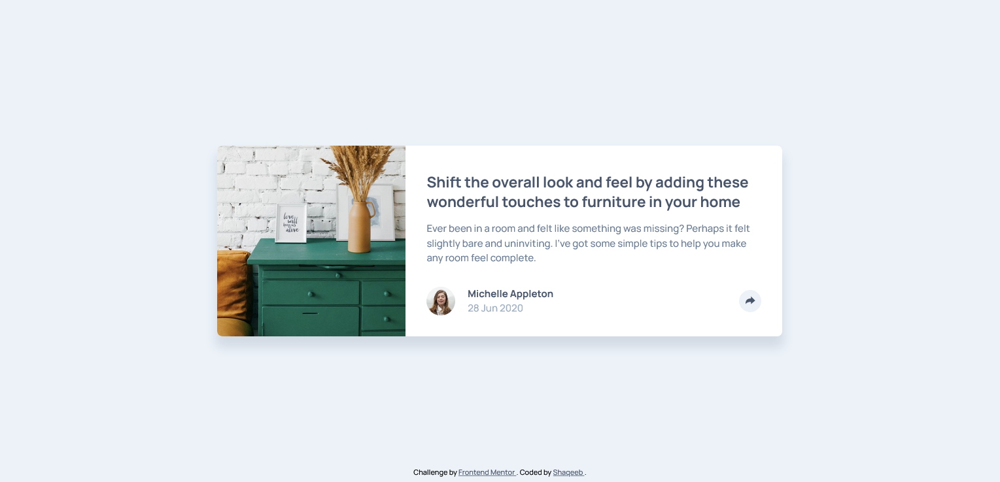

# Frontend Mentor - Article preview component solution

This is a solution to the [Article preview component challenge on Frontend Mentor](https://www.frontendmentor.io/challenges/article-preview-component-dYBN_pYFT).

## Table of contents

- [The challenge](#the-challenge)
- [Screenshot](#screenshot)
- [Links](#links)
- [Built with](#built-with)
- [Author](#author)

### The challenge

Users should be able to:

- View the optimal layout for the component depending on their device's screen size
- See the social media share links when they click the share icon

### Screenshot

### Links

- Solution URL: [Frontend Mentor](https://www.frontendmentor.io/solutions/article-preview-component-oBnIuZ6f9)
- Live Site URL: [Netlify](https://frontendmentor-article-preview-card.netlify.app/)

### Built with

- Semantic HTML5 markup
- CSS custom properties
- Flexbox
- CSS Grid

## Author

- GitHub - [@shaqeebakhtar](https://www.github.com/shaqeebakhtar)
- Frontend Mentor - [@shaqeebakhtar](https://www.frontendmentor.io/profile/shaqeebakhtar)
- Twitter - [@shaqeeb_akhtar](https://www.twitter.com/shaqeeb_akhtar)
